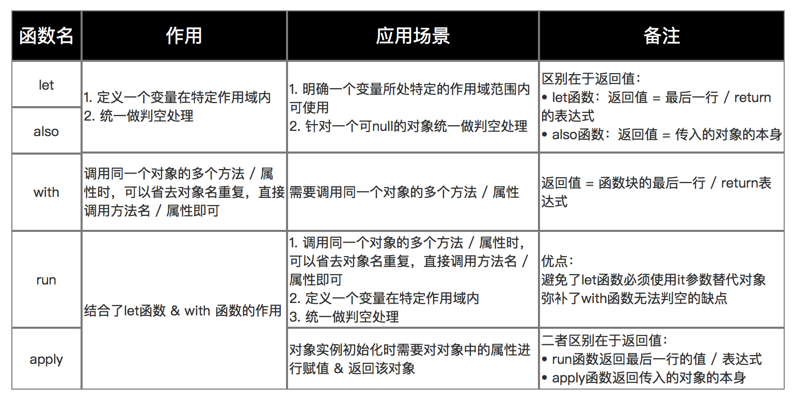

# Kotlin 内置函数

- let
- also
- with
- run
- apply

## let

```kotlin
// 使用Java
if( mVar != null ){
    mVar.function1();
    mVar.function2();
    mVar.function3();
}

// 使用kotlin（无使用let函数）
mVar?.function1()
mVar?.function2()
mVar?.function3()

// 使用kotlin（使用let函数）
// 方便了统一判空的处理 & 确定了mVar变量的作用域
mVar?.let {
       it.function1()
       it.function2()
       it.function3()
}
```

## also

```kotlin
// let函数
var result = mVar.let {
               it.function1()
               it.function2()
               it.function3()
               999
}
// 最终结果 = 返回999给变量result

// also函数
var result = mVar.also {
               it.function1()
               it.function2()
               it.function3()
               999
}
// 最终结果 = 返回一个mVar对象给变量result
```

## with

调用同一个对象的多个方法 / 属性时，可以省去对象名重复，直接调用方法名 / 属性即可

场景：需要调用同一个对象的多个方法 / 属性

```kotlin
// 此处要调用people的name 和 age属性
// kotlin
val people = People("carson", 25)
with(people) {
println("my name is $name, I am $age years old")
}

// Java
User peole = new People("carson", 25);
String var1 = "my name is " + peole.name + ", I am " + peole.age + " years old";
System.out.println(var1);
```

## run

结合了let、with两个函数的作用

```kotlin
object.run{
// ... 
}
// 返回值 = 函数块的最后一行 / return表达式

// 此处要调用people的name 和 age属性，且要判空
// kotlin
val people = People("carson", 25)
people?.run{
    println("my name is $name, I am $age years old")
}

// Java
User peole = new People("carson", 25);
String var1 = "my name is " + peole.name + ", I am " + peole.age + " years old";
System.out.println(var1);
```

## apply

```kotlin
// example_1
val person = Person().apply{
    setName("Jack")
    setAge(11)
}

// example_2
fun allphabetApply() = StringBuilder().apply {
    append("alphabet:\n")
    for (letter in 'A'..'Z') {
        append(letter)
    }
    append("\nI know the alphabet")
}.toString()

```

## 总结



## 参考

https://blog.csdn.net/carson_ho

https://www.jianshu.com/p/605a382bff0c