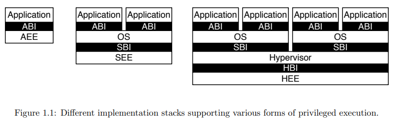
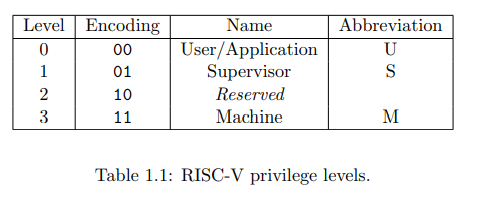
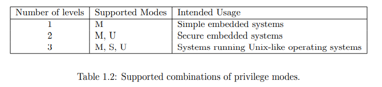
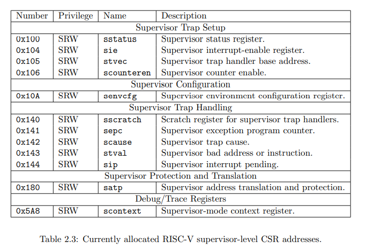

# Qemu 和 RustSBI

Qemu 是一个开源的计算机仿真模拟器，可以模拟不同架构的计算机，提供裸机和用户模式的模拟

RustSBI 同 OpenSBI，后者由 C语言 实现，全称是 RISC-V Supervisor Binary Interface ([SBI](https://github.com/riscv-non-isa/riscv-sbi-doc/)) library 

## 有关 Privileged Specifications（特权级规范）

[文档下载地址，点我](https://riscv.org/technical/specifications/)

## 细说 ABI: Application Binary Interface 应用二进制接口

其规范了以下内容：（到这里就是和寄存器与具体内存打交道了）

- 数据类型的大小，数据的对其方式
- 函数调用时发生的调用约定。比如参数的入栈顺序啊等
- 系统调用的编号，以及系统调用的方式。不同的系统可能系统函数的中断号不同等
- 目标文件的二进制格式，程序库的格式等。比如Linux下的ELF格式的文件与Windows下的可执行文件就有区别。

ABI 和 API 没有直接的关系，两者是不同的概念

#### ABI 概念

- 广义上ABI 的概念

> **泛指**应用程序在二进制层面应该遵循的规范

- 狭义上ABI的概念

> 特指
>
> - 某个具体硬件平台的ABI规范文档
> - 某个具体操作系统平台的ABI规范文档
> - 某个具体虚拟机平台的ABI规范文档

#### 总结

- 广义上的ABI指应用程序在二进制层面需要遵守的约定
- 狭义上的ABI指一个具体硬件或者操作系统的规范文档
- ABI定义了基础数据类型的大小
- ABI定义了结构体/联合体的内存对齐方式

ISA：指令集架构

### AEE: Application execution environment 应用执行环境

### ABI: Application binary interface 应用二进制接口

后者（ABI）包括一系列支持的 user-level 的指令集，和一套与 AEE 交互的二进制接口（**接口内容规范包括基础数据类型的大小，数据对齐的方式等**）

参考下图左一

中间的是当前常见（传统）的 OS 架构：

SBI(Supervisor Binary Interface) 特权级二进制接口

类似的，在虚拟机上有 HEE(hypervisor execution envireonment)：虚拟机通过 HBI(hypervisor binary interface) 与 HEE 交互

## 不同特权级

CSRs (control and status registers) 控制与状态寄存器

比如 Supervisor 特权级中：S(Supervisor) + 相关缩写

| CSR 名  | 该 CSR 与 Trap 相关的功能                                    |
| ------- | ------------------------------------------------------------ |
| sstatus | `SPP` 等字段给出 Trap 发生之前 CPU 处在哪个特权级（S/U）等信息 |
| sepc    | 当 Trap 是一个异常的时候，记录 Trap 发生之前执行的最后一条指令的地址 |
| scause  | 描述 Trap 的原因                                             |
| stval   | 给出 Trap 附加信息                                           |
| stvec   | 控制 Trap 处理代码的入口地址                                 |

由上到下分别是不同特权级组合后可支持的系统：例如只支持 M(Machine)特权级（无OS）的简单的嵌入式系统到类 Unix 的完整 OS

## Debug Mode （懒得看了）

### (Supervisor) CSRs

## RustSBI 到底长啥样

[crate文档，链接可能过时，需注意](https://docs.rs/rustsbi/0.3.0/rustsbi/)

RustSBI 运行在 M-mode

https://github.com/rustsbi/rustsbi 懒得写了，翻翻源码趴QwQ
