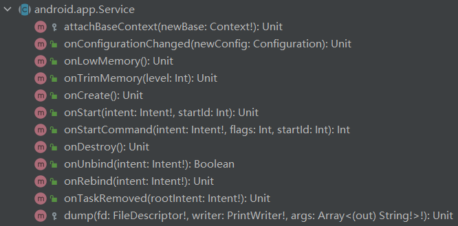

## Activity

### activity 生命周期

*从不可见到可见，从可见到不可见*

1. onCreate 初始化工作，如 setContentView 等
2. onStart 启动activity
3. onResume 画面渲染
4. **回到桌面**，activity 暂停 onPause（此时 Activity 会在暂停后被停止，停止时可调用 onStop 中的内容
5. activity 停止 onStop（当 activity 转到后台时，其将被停止，不再运行）若想在后台运行可用 Service
6. 重新将 activity 从后台启用，执行 onRestart，再渲染，即执行 onResume
7. **跳转到另一个activity**：onPause -> onStop；**从另一个activity返回**：onStart -> onResume
8. 如果不是回到桌面而是按返回键来退出 activity，activity将被销毁：onPause -> onStop -> onDestroy

### 不同函数的用途

#### onCreate

布局、控件等的加载，例如：setContentView 等

#### onStart

初始化的启动工作，例如标签的改变，用户自动登录等等

#### onResume

可理解为可视化界面的渲染，即往常看到的app界面

#### onPause

使app界面不可见

对应关系

| 启动     | 停止      |
| -------- | --------- |
| onCreate | onDestroy |
| onStart  | onStop    |
| onResume | onPause   |

## Service

不可见的后台程序，例如音乐播放器等

### Service 生命周期

由 activity 启动



### 在清单注册 `AndroidManifest.xml`

```xml
<service android:name=".UpdateDataService" />
```

### 启动服务

```kotlin
// In MainActivity
startService(Intent!)
startService(View)
stopService(name: Intent!)
```

### bindService

将 Service 与 Activity 关联，具体表现为 activity 退出时，绑定的 service 也会 destroy

对应 Service 的周期函数 onBind、onUnbind

**注：绑定需要一个 `ServiceConnection`**

*一般在 activity 的 onDestroy 中调用 unbindService(connection)*

## Receiver

广播接收者

系统的广播和用户自定义的广播

给 activity 注册：静态注册（不常见），动态注册

```kotlin
class MyReceiver : BroadcastReceiver() {
    override fun onReceive(p0: Context?, p1: Intent?) {
        // ...
    }
}
```

#### 静态注册

```xml
<receiver android:name=".MyReceiver">
	<intent-filter>
    	<action android:name="fun.sslime.abaaba"/> <!-- 和下文保持一致 -->
    </intent-filter>
</receiver>
```

```java
public interface ActionUtils {
    String ACTION_ABAABA = "fun.sslime.abaaba";
}
```

#### 动态注册

**不需要写在清单文件中**

通过代码初始化接收者(可写在 activity 的 onCreate 中)

```kotlin
val myReceiver = MyReceiver()
val filter = IntentFilter()
filter.addAction(ActionUtils.ACTION_ABAABA)
registerReceiver(myReceiver, filter)
```

#### 发送消息给 Receiver

```kotlin
var intent = Intent()
intent.setAction(ActionUtils.ACTION_ABAABA)
sendBroadcast(intent)
```

## ContentProvider

为不同的应用之间数据共享，提供统一的接口

